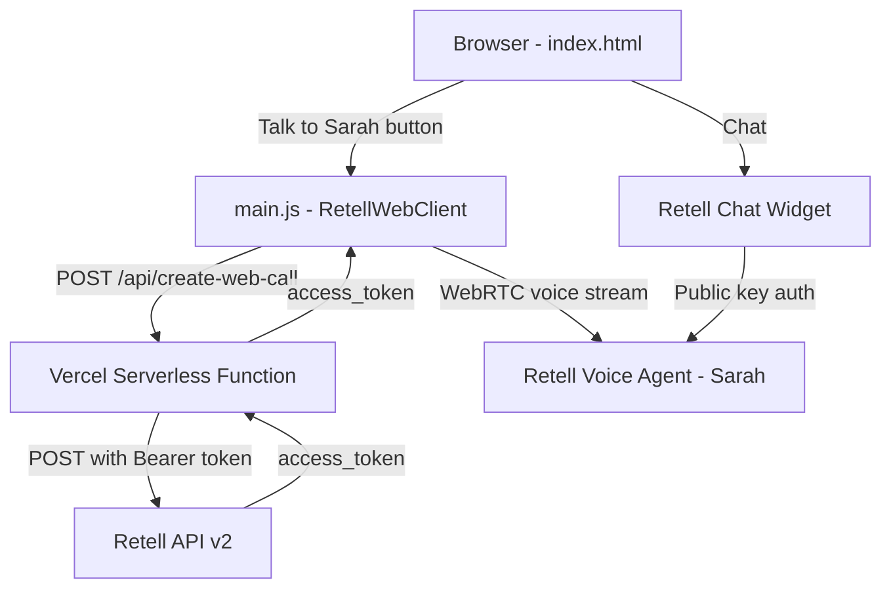

# Tertiary Infotech Academy - AI Voice Agent Website


> A landing page for Tertiary Infotech Academy featuring an AI voice assistant (Sarah) powered by Retell.io, with both chat widget and real-time voice call capabilities.

[Live Demo](https://retell-lake.vercel.app)


---

## Table of Contents

- [Features](#features)
- [Tech Stack](#tech-stack)
- [Architecture](#architecture)
- [Project Structure](#project-structure)
- [Prerequisites](#prerequisites)
- [Getting Started](#getting-started)
- [Configuration](#configuration)
- [Deployment](#deployment)
- [License](#license)
- [Acknowledgments](#acknowledgments)

---

## Features

- **AI Voice Calls** - Browser-based real-time voice conversations with Sarah using Retell Web Client SDK
- **AI Chat Widget** - Embedded Retell chat popup for text-based assistance
- **Voice Call Modal** - Animated call interface with speaking indicators, call timer, and ripple effects
- **Responsive Design** - Fully mobile-friendly layout with Inter typography
- **Serverless API** - Secure backend via Vercel serverless functions (API key never exposed to client)
- **Local Dev Server** - Express server for local development and testing

---

## Tech Stack

| Layer | Technology | Purpose |
|-------|------------|---------|
| Frontend | HTML, CSS, JavaScript (ES Modules) | Landing page and voice call UI |
| AI Voice | [Retell Web Client SDK](https://www.npmjs.com/package/retell-client-js-sdk) | Real-time browser voice calls |
| AI Chat | [Retell Chat Widget](https://www.retellai.com/) | Embedded chat popup |
| Backend (prod) | Vercel Serverless Functions | Secure API proxy for Retell |
| Backend (dev) | Express.js | Local development server |
| Hosting | Vercel | Static files + serverless |
| Fonts | Google Fonts (Inter) | Typography |

---

## Architecture



---

## Project Structure

```
voiceagent/
├── api/
│   └── create-web-call.js   # Vercel serverless function (API proxy)
├── .env                      # Environment variables (gitignored)
├── .github/
│   └── workflows/
│       └── deploy.yml        # GitHub Pages workflow (legacy)
├── .gitignore
├── index.html                # Main landing page
├── main.js                   # Voice call logic (ES module)
├── package.json              # Dependencies (Express, dotenv)
├── server.js                 # Local Express dev server
├── styles.css                # All styles including voice modal
├── vercel.json               # Vercel deployment config
└── README.md
```

---

## Prerequisites

- [Node.js](https://nodejs.org/) v18 or higher
- A [Retell AI](https://www.retellai.com/) account with:
  - An agent created (you'll need the `agent_id`)
  - A **secret API key** (starts with `key_`)
  - A **public key** (starts with `public_key_`)

---

## Getting Started

### 1. Clone the repository

```bash
git clone https://github.com/alfredang/voiceagent.git
cd voiceagent
```

### 2. Install dependencies

```bash
npm install
```

### 3. Configure environment

```bash
cp .env.example .env
```

Edit `.env` and add your Retell secret API key:

```
RETELL_API_KEY=key_your_secret_key_here
```

### 4. Start the local server

```bash
npm start
```

The site will be running at `http://localhost:3000`.

---

## Configuration

| Variable | Description | Required |
|----------|-------------|----------|
| `RETELL_API_KEY` | Retell secret API key (starts with `key_`) | Yes |

### Client-side configuration

In `index.html`, update the Retell chat widget attributes:

| Attribute | Description |
|-----------|-------------|
| `data-public-key` | Your Retell public key |
| `data-agent-id` | Your Retell agent ID |
| `data-bot-name` | Display name for the chat bot |

In `main.js`, update:

| Constant | Description |
|----------|-------------|
| `AGENT_ID` | Your Retell agent ID for voice calls |

---

## Deployment

### Vercel (Recommended)

1. Install Vercel CLI:
   ```bash
   npm i -g vercel
   ```

2. Link and deploy:
   ```bash
   vercel link
   vercel --prod
   ```

3. Add environment variable:
   ```bash
   vercel env add RETELL_API_KEY production
   ```

The serverless function at `api/create-web-call.js` handles the Retell API proxy automatically.

---

## License

MIT License

---

## Acknowledgments

- [Retell AI](https://www.retellai.com/) - Voice and chat AI agent platform
- [Vercel](https://vercel.com/) - Hosting and serverless functions
- [Google Fonts](https://fonts.google.com/) - Inter typeface
